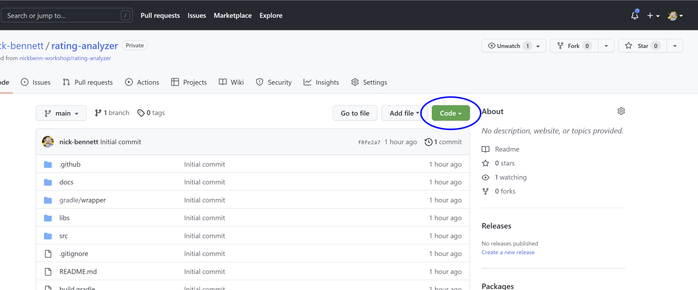
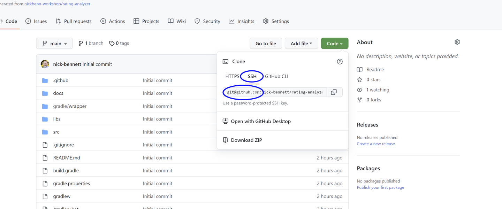
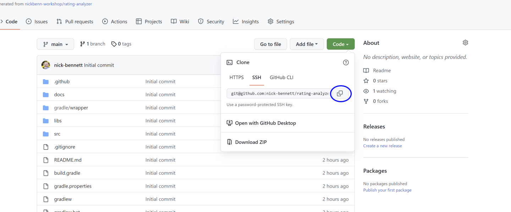
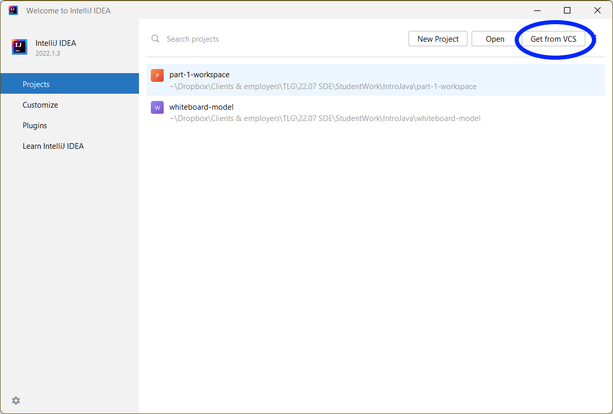
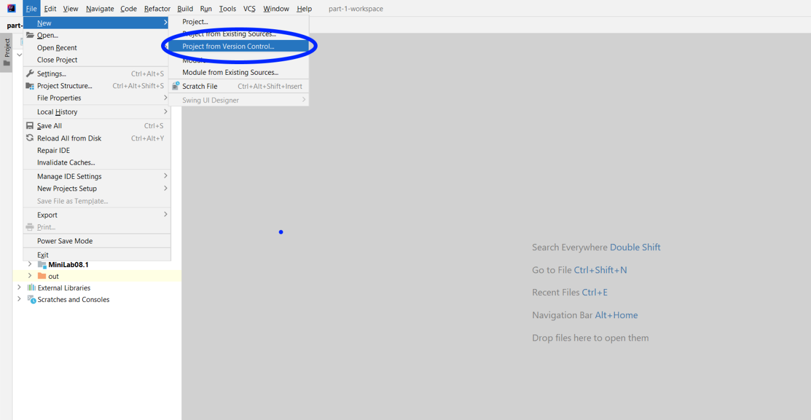
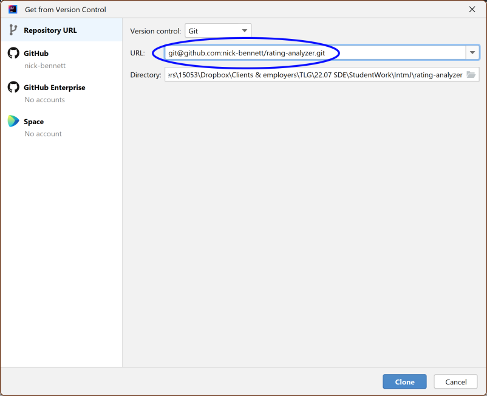
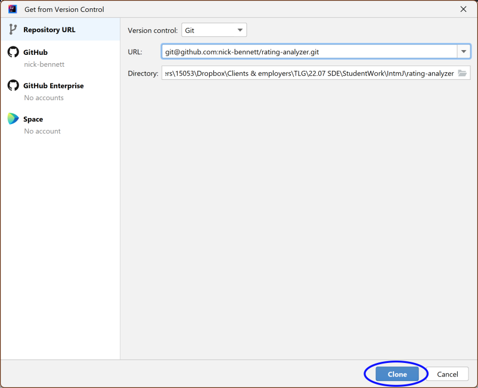
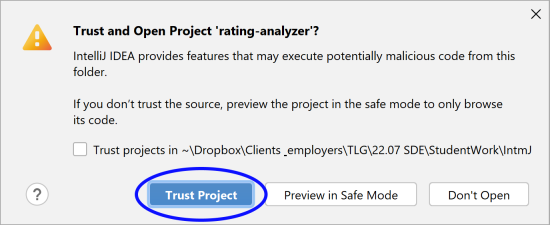
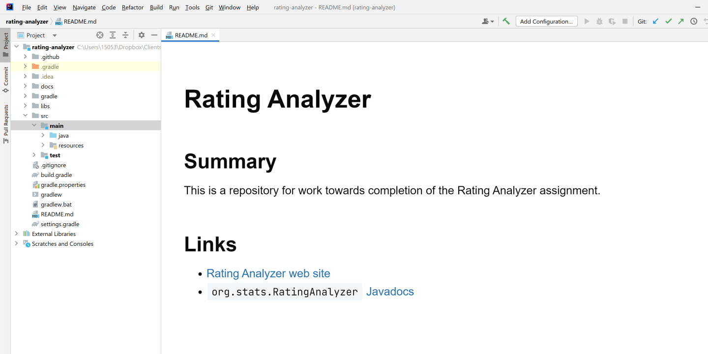




# {{ page.title }}
{:.no_toc}

The repository you've created is a _private_ repository, with access restricted to you and your instructor. Initially, the repository is remote, located only in GitHub, and not on your own machine; however, any changes you make to its contents should be done on a local clone of the repository, not directly in GitHub.

Cloning a repository from a remote host (GitHub, GitLabs, BitBucket, etc.) is done using the `git clone` command; however, it's generally easier to clone it and open it directly in your IDE, instead of cloning it from the command line and then opening it in the IDE. The steps below are those required to clone and open it in IntelliJ IDEA. (Note that the Git software must be installed on your system, and IntelliJ configured to use it, even when performing this operation via IntelliJ IDEA.) 

1. In GitHub, use the **Code** button to get the URL for the repository

     

2. Make sure that the **SSH** tab button is selected; this will generate a URL that starts with `git@github.com:`, and **not** `https://github.com/`.

     

3. Click the copy button that appears to the right of the URL (you don't need to select the text of the URL before doing this).

    

4. From the **Welcome** screen of IntelliJ IDEA, click the **Get from VCS** button.

    

    _Alternatively_, if you already have a project open in the IntelliJ IDEA workspace, select the **File/New/Project from Version Control** menu command.

   

   (**Note**: **Don't do both** of these operations: do the first if you have the IntelliJ IDEA **Welcome** screen displayed; do the second if you already have the IntelliJ IDEA workspace open.)

5. Paste the URL you copied from GitHub in step 3 into the **URL** field of the **Get from Version Control** window, and verify the **Directory** value, to make sure that the directory for the cloned repository will be created in the desired parent directory.

   

6. Click the **Clone** button.

   

6. Since this is the first time IntelliJ IDEA is opening this project on your machine, you must confirm that you trust the project contents.

   

7. When the repository is first opened, the `README.md` file will be displayed. This file is fairly minimal, with only a headline, summary sentence, and two links---one to this site, and one to the [Javadocs for the `org.stats`]({{ javadocs }}{:target='_blank'}) package.

   
